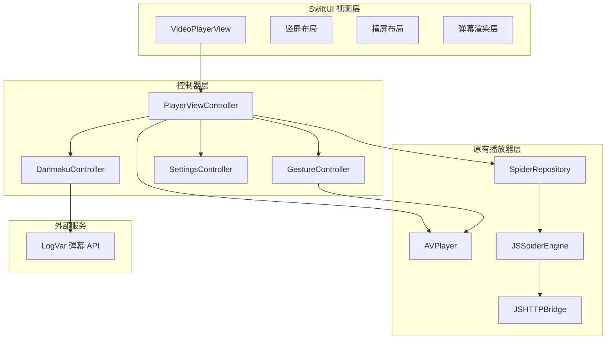
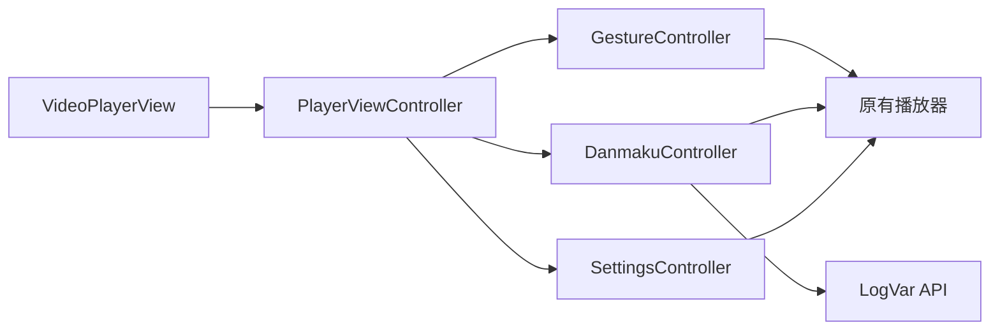

# 视频播放器重构技术设计

功能名称：video-player-redesign
更新日期：2026-06-06

## 描述

本设计文档定义了 vbox iOS 应用中视频播放器重构的技术实现方案。重构目标是在保持原有播放内核不变的前提下，实现类似爱奇艺的播放器 UI，包括竖屏/横屏双布局、手势控制、弹幕渲染等功能。新设计将作为 UI 层封装在原有播放器之上，通过调用现有接口实现功能对接。

## 架构

### 整体架构



### 模块依赖关系



## 组件和接口

### 1. VideoPlayerView（主视图）

**职责**：播放器的主视图容器，负责布局切换和子视图管理

**接口**：
```swift
struct VideoPlayerView: View {
    let videoURL: URL
    let videoTitle: String
    let episodeData: [Episode]

    var body: some View {
        // 根据 orientation 显示竖屏或横屏布局
    }
}
```

### 2. PlayerViewController（播放控制器）

**职责**：管理播放器的核心逻辑，协调各个子控制器

**接口**：
```swift
class PlayerViewController: UIViewController {
    // 原有播放器引用
    var avPlayer: AVPlayer

    // 播放控制接口
    func play()
    func pause()
    func seek(to time: CMTime)
    func setPlaybackRate(_ rate: Float)

    // 清晰度切换接口（调用原有逻辑）
    func switchQuality(_ quality: VideoQuality)

    // 选集切换接口（调用原有逻辑）
    func switchEpisode(_ episode: Episode)

    // 弹幕控制接口
    func enableDanmaku(_ enabled: Bool)
    func setDanmakuOpacity(_ opacity: CGFloat)
    func setDanmakuFontSize(_ size: CGFloat)

    // 代理回调
    var delegate: PlayerViewControllerDelegate?
}
```

### 3. GestureController（手势控制器）

**职责**：处理播放器画面上的各种手势操作

**接口**：
```swift
class GestureController: NSObject {
    weak var playerViewController: PlayerViewController?

    func setupGestures(on view: UIView) {
        // 左滑右滑：快进/后退
        // 左侧上下滑动：亮度调节
        // 右侧上下滑动：音量调节
        // 单击：显隐 UI
        // 双击：暂停/播放
    }

    @objc func handlePanGesture(_ gesture: UIPanGestureRecognizer)
    @objc func handleTapGesture(_ gesture: UITapGestureRecognizer)
    @objc func handleDoubleTapGesture(_ gesture: UITapGestureRecognizer)
}
```

### 4. DanmakuController（弹幕控制器）

**职责**：管理弹幕的获取、渲染和自定义设置

**接口**：
```swift
class DanmakuController {
    weak var playerViewController: PlayerViewController?

    // 弹幕获取
    func fetchDanmaku(for videoTitle: String, episode: Int, completion: @escaping ([Danmaku]) -> Void)

    // 弹幕渲染
    func startRendering()
    func pauseRendering()
    func resumeRendering()
    func clearDanmaku()

    // 弹幕设置
    func setDanmakuEnabled(_ enabled: Bool)
    func setDanmakuOpacity(_ opacity: CGFloat)
    func setDanmakuFontSize(_ size: CGFloat)
    func setDanmakuMode(_ mode: DanmakuMode)
}
```

### 5. SettingsController（设置控制器）

**职责**：管理播放器的各种设置项（清晰度、倍速、画面比例等）

**接口**：
```swift
class SettingsController {
    weak var playerViewController: PlayerViewController?

    func showQualitySelection()  // 显示清晰度选择弹窗
    func showSpeedSelection()     // 显示倍速选择弹窗
    func showAspectRatioSelection()  // 显示画面比例选择弹窗
    func showEpisodeSelection()   // 显示选集列表弹窗
    func showDanmakuSettings()    // 显示弹幕设置弹窗
}
```

### 6. LogVar API Client（弹幕 API 客户端）

**职责**：与 LogVar 弹幕 API 进行交互

**接口**：
```swift
class LogVarAPIClient {
    static let shared = LogVarAPIClient()
    private let baseURL = "https://uzdm.616222.xyz"

    func searchAnime(keyword: String, completion: @escaping ([AnimeInfo]) -> Void)
    func searchEpisodes(animeId: String, completion: @escaping ([Episode]) -> Void)
    func getDanmaku(commentId: String, completion: @escaping ([Danmaku]) -> Void)
    func getSegmentDanmaku(commentId: String, segment: Int, completion: @escaping ([Danmaku]) -> Void)
}
```

## 数据模型

### 1. Episode（集数信息）

```swift
struct Episode: Identifiable {
    let id: String
    let name: String
    let number: Int
    let url: URL?
}
```

### 2. VideoQuality（清晰度）

```swift
enum VideoQuality: String, CaseIterable {
    case standard = "标清"
    case high = "高清"
    case blueRay = "蓝光"
}
```

### 3. Danmaku（弹幕）

```swift
struct Danmaku {
    let id: String
    let text: String
    let time: CMTime
    let type: DanmakuType
    let color: UIColor
    let fontSize: CGFloat
    let position: CGPoint
}

enum DanmakuType {
    case scroll      // 横向滚动
    case top         // 顶部固定
    case bottom      // 底部固定
}
```

### 4. AnimeInfo（动漫信息）

```swift
struct AnimeInfo {
    let id: String
    let title: String
    let coverURL: URL?
    let description: String?
}
```

### 5. DanmakuMode（弹幕模式）

```swift
enum DanmakuMode: String, CaseIterable {
    case all = "全部"
    case scrollOnly = "仅滚动"
    case topBottomOnly = "仅顶部底部"
}
```

## 正确性属性

### 1. 播放控制一致性

- **属性**：播放控制操作（播放、暂停、seek、倍速）必须准确反映在视频播放器上
- **验证**：每次操作后验证 AVPlayer 的状态是否与预期一致

### 2. 手势响应准确性

- **属性**：手势操作必须准确触发对应功能，无误触或延迟
- **验证**：通过单元测试验证各种手势的响应时间和准确性

### 3. 弹幕同步性

- **属性**：弹幕显示时间必须与视频播放时间精确同步
- **验证**：通过对比弹幕时间戳和视频当前时间验证同步性

### 4. 布局切换流畅性

- **属性**：竖屏和横屏布局切换必须流畅，无卡顿或闪烁
- **验证**：通过性能测试验证布局切换的帧率和响应时间

### 5. 兼容性保证

- **属性**：新 UI 必须不影响原有播放器的功能
- **验证**：集成测试确保原有功能（搜索、解析、播放）正常工作

## 错误处理

### 1. 弹幕 API 请求失败

**场景**：LogVar API 无法访问或返回错误

**处理策略**：
- 显示友好的错误提示："弹幕加载失败"
- 在重试机制失败后，自动禁用弹幕功能
- 不影响视频正常播放
- 记录错误日志供后续排查

### 2. 网络连接问题

**场景**：设备网络不可用或网络延迟过高

**处理策略**：
- 显示网络状态提示
- 弹幕加载超时后自动降级为无弹幕模式
- 允许用户手动重试

### 3. 清晰度切换失败

**场景**：用户选择的清晰度不可用

**处理策略**：
- 显示提示："该清晰度暂不可用"
- 回退到默认清晰度
- 记录失败的清晰度选择，避免重复尝试

### 4. 选集切换失败

**场景**：选择的集数播放源解析失败

**处理策略**：
- 显示错误提示："无法播放该集"
- 保留当前播放状态
- 提供重新选择集数的选项

### 5. 手势识别冲突

**场景**：多个手势同时触发或识别错误

**处理策略**：
- 设置手势优先级：双击 > 单击 > 滑动
- 实现手势冲突解决机制
- 提供手势灵敏度设置选项

## 测试策略

### 1. 单元测试

**测试范围**：
- 手势控制器的手势识别逻辑
- 弹幕控制器的时间同步和渲染逻辑
- 设置控制器的各种设置项切换
- LogVar API 客户端的数据解析

**测试工具**：XCTest

### 2. UI 测试

**测试范围**：
- 竖屏和横屏布局的正确显示
- 控制栏的显隐切换
- 弹窗的正确弹出和关闭
- 手势操作的交互体验

**测试工具**：XCUITest

### 3. 集成测试

**测试范围**：
- 新播放器与原有播放器的集成
- 弹幕功能与视频播放的集成
- 清晰度、倍速、选集功能的端到端测试
- LogVar API 与播放器的集成

**测试环境**：iOS 模拟器和真机

### 4. 性能测试

**测试范围**：
- 弹幕渲染的性能（每秒可渲染的最大弹幕数）
- 布局切换的响应时间
- 手势识别的延迟
- 内存占用和 CPU 使用率

**测试工具**：Instruments

### 5. 兼容性测试

**测试范围**：
- 不同 iOS 版本（iOS 15.0+）
- 不同设备屏幕尺寸
- 不同视频格式和清晰度
- 不同网络环境

## 参考文献

[^1]: (Website) - LogVar 弹幕 API 文档 - https://uzdm.616222.xyz
[^2]: (Website) - vbox iOS 项目 - https://github.com/hf805864818/vbox-ios
[^3]: (Website) - AVFoundation 框架文档 - https://developer.apple.com/documentation/avfoundation
[^4]: (Website) - SwiftUI 手势处理 - https://developer.apple.com/documentation/swiftui/gestures
[^5]: (Website) - 爱奇艺播放器 UI 设计参考 - https://github.com/hf805864818/calendar-notice-static/tree/514fa6b7b71b0f782198072d4e55eb9535c43aa0/assets/tu